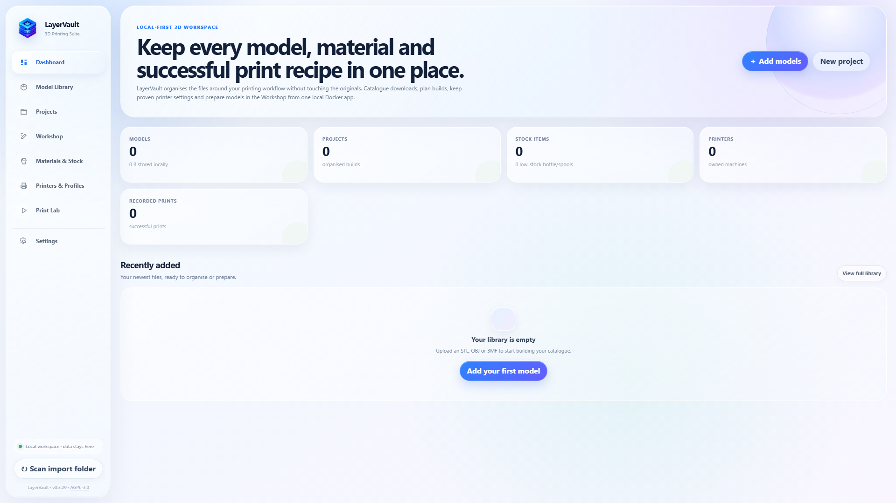
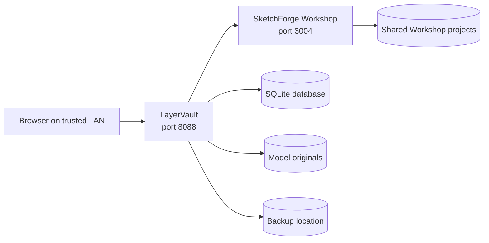
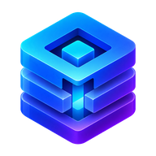

<p align="center">
  
</p>

# LayerVault

<p align="center">
  <strong>Keep every model, material, machine and successful print recipe in one local workspace.</strong>
</p>

<p align="center">
  
  
  
  
</p>

LayerVault is a local-first 3D-printing suite for cataloguing model files, planning projects, tracking printers and stock, recording print results and preparing models in a browser-native workshop. Your database, originals and backups stay on storage you control.

> [!IMPORTANT]
> LayerVault is intended for a trusted home, studio or workshop network. Do not expose ports `8088` or `3004` directly to the public internet.

## A look inside

<p align="center">
  
</p>

<p align="center"><sub>The LayerVault dashboard in the Frost glass theme.</sub></p>

## Everything around the print

| | Workspace | What it handles |
|---:|---|---|
| 📦 | **Model Library** | Searchable originals, thumbnails, tags, creator details, licences and model health checks. |
| 🗂️ | **Projects** | Group models into builds, set quantities and variants, and prioritise what should print first. |
| 🧰 | **Workshop** | Browser-native SketchForge preparation and CAD tools—no streamed desktop or VNC session. |
| 🧵 | **Materials & Stock** | Filament spools and resin bottles with colour, remaining stock, cost, photos and catalogue data. |
| 🖨️ | **Printers & Profiles** | Physical machines, FDM/resin profiles, defaults and matching printer artwork. |
| 🧾 | **Print Lab** | Queue jobs, attach multiple models, inspect sliced files and preserve the settings behind each result. |
| 💾 | **Settings & Backups** | Glass themes, separate storage locations and scheduled scoped backups. |

## Quick start

### Requirements

- Docker Desktop, or Docker Engine with the Compose plugin
- Enough local disk space for the application build
- A mounted disk or NAS share if model files or backups live elsewhere

### Start LayerVault

From the directory containing `docker-compose.yml`:

```bash
docker compose up -d --build
```

Then open:

- **LayerVault:** [http://localhost:8088](http://localhost:8088)
- **Workshop:** [http://localhost:3004](http://localhost:3004), loaded inside LayerVault
- **Health check:** [http://localhost:8088/health](http://localhost:8088/health)

Check that both services are healthy:

```bash
docker compose ps
```

### Updating an existing installation

```bash
docker compose down --remove-orphans
docker compose up -d --build
```

The first command removes containers retired from older LayerVault releases. It does **not** delete your bind-mounted data folders.

## Storage that fits your setup

Copy `.env.example` to `.env`, then keep everything together or split the database, model originals and backups across separate disks or mounted NAS shares.

```dotenv
LAYERVAULT_DATA_PATH=./data
LAYERVAULT_DATABASE_PATH=./data
LAYERVAULT_MODELS_PATH=//PRINT-NAS/3d-models
LAYERVAULT_BACKUPS_PATH=//BACKUP-NAS/layervault

# Parent folders that the Settings page is allowed to use
LAYERVAULT_STORAGE_ROOT_1=./data
LAYERVAULT_STORAGE_ROOT_2=//PRINT-NAS
LAYERVAULT_STORAGE_ROOT_3=//BACKUP-NAS
LAYERVAULT_STORAGE_ROOT_4=/mnt/another-mounted-share
```

The first four values are the live locations used on startup. The `STORAGE_ROOT` values are broader administrator-approved folders that Settings may use. After deploying v0.3.32, enter a root or any subfolder below it, choose **Apply & restart**, and LayerVault copies the existing data before switching. The original files are retained as a safety copy.

To make a completely new disk or network share available, change one of the four `LAYERVAULT_STORAGE_ROOT_*` variables in Portainer (or `.env`) and redeploy once. This keeps the web application away from the Docker socket and from unrelated host files.

### One-click new locations with Portainer

LayerVault v0.3.32 can perform that remount automatically for Portainer stacks:

1. Open the LayerVault stack in Portainer and enable its **Stack webhook**.
2. Copy the generated webhook URL.
3. In LayerVault, open **Settings → Storage locations**, paste it under **Portainer one-click remount**, and choose **Connect**. Enable the self-signed-certificate option only when your local Portainer HTTPS certificate is not trusted by the container.
4. Enter any local host folder or already-mounted SMB/NFS path and choose **Apply & restart**.

LayerVault asks Portainer to expose only the four entered locations and redeploy the stack. After it returns, LayerVault copies the existing files, makes a consistent SQLite copy, stores the new mapping and restarts once more. The webhook is a secret capable of redeploying this stack; do not publish or share it.

Ordinary Docker Compose installations can still use pre-approved roots. Docker itself does not allow an unprivileged running container to add a new host bind mount, so completely new roots require either a Compose redeploy or a deployment-manager integration such as the Portainer webhook.

| Setting | Purpose | Default |
|---|---|---|
| `LAYERVAULT_DATA_PATH` | Working data, thumbnails, uploads, print photos and Workshop projects | `./data` |
| `LAYERVAULT_DATABASE_PATH` | SQLite database directory | `./data` |
| `LAYERVAULT_MODELS_PATH` | Original model files | `./data/files` |
| `LAYERVAULT_BACKUPS_PATH` | Manual and scheduled backup archives | `./data/backups` |
| `LAYERVAULT_STORAGE_ROOT_1` … `_4` | Administrator-approved parent folders available to Apply & restart | Current local data defaults |
| `LAYERVAULT_TIMEZONE` | Timestamps and backup schedules | `Europe/London` |
| `APP_USERNAME` / `APP_PASSWORD` | Optional HTTP Basic authentication for LayerVault | Disabled when the password is blank |

Windows paths can use forward slashes, for example `D:/LayerVault/database` or `//server/share/models`. Docker Desktop must be allowed to access the selected location. On Linux, mount a NAS share on the host first and use its absolute mount path.

There are no built-in `/mnt`, `/srv` or drive-letter assumptions. Valid roots can include Linux paths such as `/media/storage` or `/home/alex/printing`, Windows paths such as `D:/LayerVault`, and accessible UNC shares such as `//NAS/Media`. The values are chosen independently by each installation.

Keep the live SQLite database on a local Linux filesystem where possible; use the NAS for model originals and backup archives. SMB/NFS locking interruptions can corrupt a live SQLite database even though those shares are suitable for ordinary files.

## How it fits together



The main application and Workshop are separate services because the browser loads SketchForge directly. Optional `APP_USERNAME` and `APP_PASSWORD` values protect LayerVault on port `8088`; they do not protect Workshop on port `3004`. Keep both services on a trusted LAN, or place them behind a properly secured VPN or reverse proxy.

## Print-file inspection

Print Lab can attach common sliced-print formats and retain any recognised estimates and parameters with the print record. This keeps the settings used for a successful print even after a starting profile changes. Detection is best-effort because slicers and printer vendors store metadata differently; every imported value remains editable before the record is saved.

## Printer and material catalogues

LayerVault combines retained, licence-compatible printer profile data and artwork with user-editable local records. Custom photos always take priority over catalogue artwork. Material imports preserve colour and useful product specifications, while generated colour-accurate spool or bottle artwork fills gaps until an exact photo is supplied.

Useful research sources such as Filament Cheat Sheet and FilamentDB are not bundled because no suitable redistribution licence or supported public API was identified.

## Workshop persistence

SketchForge supplies the complete browser-native CAD editor. Save important Workshop projects as **Shared** so they persist under `data/sketchforge/projects` and are included in LayerVault backups.

## Open-source credits

LayerVault is built alongside excellent open-source work:

- [SketchForge-3D](https://github.com/Formsmith746/SketchForge-3D) by Formsmith746 and contributors powers the browser-native Workshop.
- [DragonFruit](https://github.com/Open-Resin-Alliance/DragonFruit) contributes retained MIT-licensed Anycubic, Elegoo and Athena resin-printer artwork.
- [OrcaSlicer](https://github.com/OrcaSlicer/OrcaSlicer) contributes AGPL-3.0 FDM profile data and printer artwork.
- [UVtools](https://github.com/sn4k3/UVtools) contributes a retained data-only subset of resin-printer profiles.

LayerVault does not bundle or launch the DragonFruit, OrcaSlicer or UVtools application runtimes. Full notices and component licences are in [`THIRD_PARTY_NOTICES.md`](THIRD_PARTY_NOTICES.md) and the corresponding `third_party` directories.

## Release notes

See [`CHANGELOG.md`](CHANGELOG.md) for the complete version history. LayerVault v0.3.32 adds Portainer-assisted one-click remounting alongside portable administrator-mapped storage roots.

## Licence

LayerVault is licensed under the **GNU Affero General Public License v3.0 only** (`AGPL-3.0-only`). See [`LICENSE`](LICENSE) for the complete terms. Separately copyrighted bundled components retain their own notices and licences.

---

<p align="center">
  
  <br>
  <strong>Built for the printers, files and recipes on your own network.</strong>
</p>
